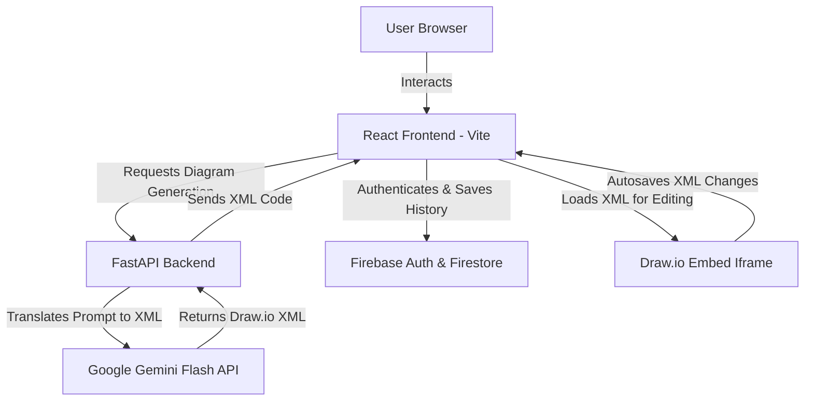

# 📊 SmartUML — AI-Powered UML Diagram Generator

SmartUML is an intelligent, AI-powered platform that translates natural language requirements into interactive, professional UML diagrams. Built with a modern, glassmorphic design system, SmartUML integrates with **Google Gemini Flash** to generate diagram specifications and embeds the **Draw.io Editor** directly to allow seamless diagram customization, version history tracking, and high-quality exports.

---

## ✨ Features

- **🤖 AI-Powered Generation**: Simply type a natural language prompt (e.g., *"Create a use case diagram for an online library system with librarian and member"*), and Gemini Flash generates a detailed, valid Draw.io XML diagram in seconds.
- **📐 Supported Diagram Types**:
  - **Use Case Diagrams** (Actors, boundaries, system interactions, relationships)
  - **Class Diagrams** (Classes, attributes, methods, inheritance, associations)
  - **Activity Diagrams** (Actions, decisions, control flows, swimlanes)
- **🎨 Interactive Prompter**: Built-in interactive dropdown helper chips for classes, attributes, methods, actions, swimlanes, and relationships to construct rich prompts without typing everything manually.
- **✏️ Embedded Draw.io Editor**: A seamless integration of the official Draw.io editor inside the application. Modifications automatically trigger unsaved change indicators in real-time.
- **💾 Cloud Sync & History**: Save your diagrams directly to your cloud dashboard. Review past generations and load them back into the editor whenever needed.
- **📥 High-Quality Exports**:
  - **PNG Image** (Retina-quality background-filled snapshot)
  - **SVG Vector** (Scalable, resolution-independent vector graphics)
  - **XML / Draw.io (.drawio)** (Re-editable in standard Draw.io web/desktop clients)
- **🔐 Secure Authentication**: Firebase Auth system protecting user dashboards and historical designs.

---

## 🛠️ Tech Stack

### Frontend
- **Framework**: React 19 + Vite 7
- **Styling**: Tailwind CSS v4 (Sleek dark mode & customized neon glow effects)
- **Animation**: Framer Motion
- **Icons**: Lucide React
- **Authentication**: Firebase Authentication
- **Diagram Render/Editing**: Draw.io GraphViewer & Embed APIs

### Backend
- **Framework**: FastAPI (Python)
- **AI Integration**: Google Gemini API (Gemini Flash Model)
- **Validation**: Pydantic v2
- **Logging**: Standard Python log configuration with automated service diagnostics

### Database & Storage
- **Cloud Database**: Google Cloud Firestore (Document Storage)
- **Hosting Support**: Ready for Vercel/Netlify (Frontend) & Render/Railway (Backend)

---

## 🏗️ System Architecture



---

## 🚀 Getting Started

Follow these steps to set up SmartUML on your local machine.

### Prerequisites
Make sure you have the following installed:
- [Node.js](https://nodejs.org/) (v18 or higher)
- [Python](https://www.python.org/) (v3.10 or higher)
- A Google Gemini API Key (Get one from [Google AI Studio](https://aistudio.google.com/))
- A Firebase Project (Set up database & authentication on the [Firebase Console](https://console.firebase.google.com/))

---

### 1. Backend Setup

1. Open your terminal and navigate to the `backend` directory:
   ```bash
   cd backend
   ```

2. Create and activate a Python virtual environment:
   - **Windows**:
     ```bash
     python -m venv venv
     .\venv\Scripts\activate
     ```
   - **macOS/Linux**:
     ```bash
     python3 -m venv venv
     source venv/bin/activate
     ```

3. Install the dependencies:
   ```bash
   pip install -r requirements.txt
   ```

4. Create a `.env` file in the `backend` directory and add your Gemini API key:
   ```env
   GEMINI_API_KEY=your_gemini_api_key_here
   ```

5. Run the FastAPI development server:
   ```bash
   uvicorn main:app --reload --port 8000
   ```
   The backend API will be available at `http://localhost:8000`. You can access interactive documentation at `http://localhost:8000/docs`.

---

### 2. Frontend Setup

1. Open a new terminal and navigate to the `client` directory:
   ```bash
   cd client
   ```

2. Install the node packages:
   ```bash
   npm install
   ```

3. Create a `.env` file in the `client` directory and populate it with your Firebase configuration:
   ```env
   VITE_FIREBASE_API_KEY=your_api_key
   VITE_FIREBASE_AUTH_DOMAIN=your_auth_domain
   VITE_FIREBASE_PROJECT_ID=your_project_id
   VITE_FIREBASE_STORAGE_BUCKET=your_storage_bucket
   VITE_FIREBASE_MESSAGING_SENDER_ID=your_messaging_sender_id
   VITE_FIREBASE_APP_ID=your_app_id
   ```

4. Start the Vite development server:
   ```bash
   npm run dev
   ```
   Open `http://localhost:5173` in your browser to view the application.

---

## 📁 Project Structure

```text
FYP-SmartUML/
│
├── backend/
│   ├── services/
│   │   └── ai_service_MASTER.py   # AI UML Generation service logic
│   ├── .env                       # Backend local environment keys
│   ├── main.py                    # FastAPI server entrypoint
│   ├── check_models.py            # API key testing utility
│   └── requirements.txt           # Python backend dependencies
│
├── client/
│   ├── public/
│   ├── src/
│   │   ├── components/            # UI components (Layout, Dropdown, Viewer, etc.)
│   │   ├── context/               # AuthContext state manager
│   │   ├── pages/
│   │   │   ├── AuthPage/          # Login & Signup layouts
│   │   │   ├── Dashboard.jsx      # AI generation prompt panel
│   │   │   ├── DiagramEditor.jsx  # Interactive Draw.io diagram editor
│   │   │   └── HistoryView.jsx    # Historical diagram visualizer
│   │   ├── App.jsx                # Router config
│   │   ├── main.jsx               # React initialization entrypoint
│   │   └── index.css              # Custom Tailwind styles and variables
│   ├── package.json               # Node packages and scripts
│   └── vite.config.js             # Bundler configuration
│
└── README.md                      # Project documentation
```

---

## 👥 Contributors

We are three friends collaborating on this Final Year Project (FYP):

- **Ausaf Uddin Ahmed** - [@AUDinCode](https://github.com/AUDinCode)
- **Shaheer Kayani** - [@ShaheerKayani145](https://github.com/ShaheerKayani145)
- **Hassan** - [@hassann783](https://github.com/hassann783)

---

## 📄 License

This project is licensed under the MIT License - see the LICENSE file for details.
